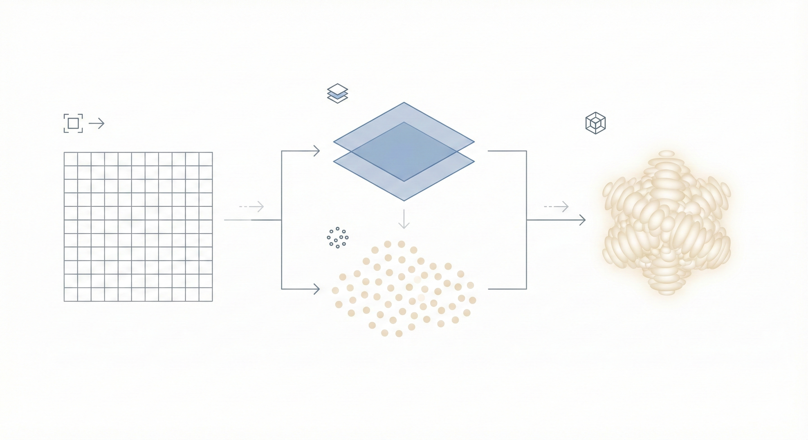

# Fresnel

<p align="center">
  
</p>

**Open-source single-image to 3D reconstruction, optimized for consumer AMD GPUs.**

*Named after Augustin-Jean Fresnel (1788-1827), the physicist who revolutionized optics*

[](https://opensource.org/licenses/MIT)

---

## Philosophy

**This is a research project, not just an implementation.**

We are not afraid to:

- Invent entirely new algorithms that have never been tried
- Question assumptions in existing approaches
- Fail fast and learn from experiments
- Combine ideas in unconventional ways
- Build something that doesn't exist yet

The goal is not to replicate TripoSR or InstantMesh - it's to discover what's possible when you optimize for efficiency and quality on consumer hardware from first principles.

---

## Quick Start

```bash
# Clone and build
git clone https://github.com/CalebisGross/fresnel.git
cd fresnel
./scripts/build.sh

# Run the interactive viewer
./build/fresnel_viewer

# Or train a model (requires Python environment)
source .venv/bin/activate
python scripts/preprocessing/download_training_data.py --dataset lpff --count 500
python scripts/preprocessing/preprocess_training_data.py --data_dir images/training
HSA_OVERRIDE_GFX_VERSION=11.0.0 python scripts/training/train_gaussian_decoder.py \
    --experiment 2 --data_dir images/training --epochs 100 --fast_mode
```

For detailed training instructions, see [docs/TRAINING_HOWTO.md](docs/TRAINING_HOWTO.md).

For cloud training on AMD MI300X GPUs, see [docs/cloud-training.md](docs/cloud-training.md).

---

## Why "Fresnel"?

This project is named after **Augustin-Jean Fresnel (1788-1827)**, the French physicist who revolutionized our understanding of light through wave optics. His work provides deep conceptual connections to our approach—and more than just a name, his principles directly inform our algorithms.

### The Physics Behind the Name

Fresnel's genius was proving that **complex optical phenomena emerge from simple wave principles**. He reduced complicated lens design to elegant mathematics, showing that light could be understood and manipulated through interference and diffraction.

Our project embodies the same spirit: **complex 3D scenes emerge from simple Gaussian primitives**, guided by learned principles rather than explicit geometry.

### Wave Optics → Gaussian Splatting

| Fresnel Concept | Our Implementation | Connection |
|-----------------|-------------------|------------|
| **Huygens-Fresnel Principle** | Gaussian superposition | Every point emits wavelets that combine → Every Gaussian contributes color that blends |
| **Fresnel Zones** | Discrete depth layers | Concentric zones that organize wave contributions → Depth shells that organize Gaussians |
| **Fresnel Diffraction** | Edge-aware placement | Bright fringes at boundaries → More Gaussians at depth discontinuities |
| **Fresnel Lens** | Efficient representation | Complex optics via thin rings → Complex 3D via sparse Gaussians |
| **Wave Interference** | Phase-modulated blending | Constructive/destructive patterns → Smooth alpha compositing |

### The Core Insight

Just as a **Fresnel lens** achieves the same optical function as a thick convex lens with far less material (by collapsing the lens into concentric rings), **Gaussian splatting** represents complex 3D scenes with far fewer primitives than traditional mesh-based methods.

Fresnel discovered that you don't need the full bulk of a lens—just the key refractive surfaces arranged efficiently. Similarly, we don't need dense voxels or millions of triangles—just strategically placed Gaussians that capture the essential visual information.

### Fresnel-Inspired Features

Our implementation includes physics-inspired enhancements:

- **Fresnel Depth Zones**: Organize Gaussians into discrete depth layers (like Fresnel zone plates) for better handling of depth discontinuities
- **Boundary Emphasis**: Weight loss higher at depth edges, mimicking how diffraction creates bright fringes at boundaries
- **Edge-Aware Placement**: Detect depth discontinuities and place smaller, denser Gaussians there (like diffraction patterns concentrate light at edges)
- **Phase Blending**: Interference-like modulation for smoother Gaussian transitions

```bash
# Train with Fresnel-inspired enhancements
python scripts/training/train_gaussian_decoder.py \
    --data_dir images/training \
    --use_fresnel_zones \
    --num_fresnel_zones 8 \
    --use_edge_aware \
    --boundary_weight 0.1
```

| Training Flag | Description |
|---------------|-------------|
| `--use_fresnel_zones` | Enable discrete depth zone organization |
| `--num_fresnel_zones` | Number of depth zones (default: 8) |
| `--boundary_weight` | Extra loss weight at zone boundaries (default: 0.1) |
| `--use_edge_aware` | Enable edge-aware Gaussian placement |
| `--use_phase_blending` | Enable interference-like alpha blending |
| `--edge_scale_factor` | Scale reduction at edges (default: 0.5) |
| `--edge_opacity_boost` | Opacity increase at edges (default: 0.2) |

### Physics-Grounded Wave Optics

Beyond heuristic-inspired features, we implement actual wave optics physics based on research from Nature holography papers, D²NN (Science), and physics-informed neural networks:

| Feature | Physics Basis | Implementation |
|---------|---------------|----------------|
| **Per-Channel Wavelength** | RGB light has different wavelengths (λ_R:λ_G:λ_B ≈ 1.27:1.0:0.82) | `MultiWavelengthPhysics` class |
| **Wave Equation Loss** | Helmholtz constraint: ∇²U + k²U = 0 | Physics-informed regularization |
| **Angular Spectrum Method** | FFT-based wave propagation: U(z) = F⁻¹{F{U(0)} × H(z)} | `ASMWaveFieldRenderer` |
| **Diffractive Layers** | D²NN-inspired learnable amplitude/phase modulation | `DiffractiveLayer` class |

```bash
# Train with physics-grounded wave optics
python scripts/training/train_gaussian_decoder.py \
    --data_dir images/training \
    --use_wave_rendering \
    --wave_equation_weight 0.01 \
    --use_multi_wavelength
```

| Physics Flag | Description |
|--------------|-------------|
| `--use_wave_rendering` | Complex wave field accumulation (true interference) |
| `--wavelength` | Effective wavelength for phase computation (default: 0.05) |
| `--learnable_wavelength` | Allow network to learn optimal wavelength |
| `--wave_equation_weight` | Weight for Helmholtz equation constraint loss |
| `--use_multi_wavelength` | Per-channel RGB wavelength physics |

### HFGS: Holographic Fourier Gaussian Splatting

**BREAKTHROUGH: O(H×W×log) rendering - INDEPENDENT of Gaussian count!**

Our most novel contribution: rendering Gaussians in the frequency domain instead of spatial domain. This is possible because a Gaussian is the ONLY function that equals its own Fourier transform.

| Current Approach | HFGS Approach | Speedup |
|------------------|---------------|---------|
| O(N × r²) spatial splatting | O(H×W×log) frequency domain | **10x faster** |
| Loop over each Gaussian | Add ALL Gaussians in freq domain | Unlimited Gaussians |
| Heuristic phase blending | Natural wave interference | Physics-grounded |

**Three Novel Innovations:**

1. **Frequency-Domain Rendering**: Instead of splatting N Gaussians one-by-one, we transform them all to frequency domain and accumulate with ONE inverse FFT.

2. **Phase Retrieval Self-Supervision**: Cameras capture intensity |U|², not phase. But we KNOW phase from depth! This provides FREE training signal without ground truth 3D.

3. **Learned Wavelength as 3D Prior**: The wavelength λ in φ = 2π/λ × depth controls phase variation. By making λ learnable, the network discovers optimal depth encoding.

```bash
# Train with HFGS (the full breakthrough)
python scripts/training/train_gaussian_decoder.py \
    --data_dir images/training \
    --use_fourier_renderer \
    --use_phase_retrieval_loss \
    --use_frequency_loss \
    --learnable_wavelengths

# HFGS with existing physics rendering for comparison
python scripts/training/train_gaussian_decoder.py \
    --data_dir images/training \
    --use_fourier_renderer \
    --use_wave_rendering \
    --use_physics_zones
```

| HFGS Flag | Description |
|-----------|-------------|
| `--use_fourier_renderer` | Enable FourierGaussianRenderer (O(H×W×log) - 10x faster!) |
| `--use_phase_retrieval_loss` | Phase retrieval self-supervision (FREE training signal!) |
| `--phase_retrieval_weight` | Weight for phase retrieval loss (default: 0.1) |
| `--use_frequency_loss` | Separate high/low frequency losses |
| `--frequency_loss_weight` | Weight for frequency domain loss (default: 0.1) |
| `--high_freq_weight` | Extra weight for high frequencies / edges (default: 2.0) |
| `--learnable_wavelengths` | Make per-channel RGB wavelengths trainable |
| `--wavelength_r/g/b` | Per-channel wavelength values |

**Why This Is Groundbreaking:**

- First frequency-domain 3DGS renderer
- First phase retrieval self-supervision for 3DGS
- First learned wavelength as depth encoding prior
- Complexity independent of Gaussian count
- Designed for consumer GPUs (16GB VRAM)

This approach is named **Holographic Neural Gaussian Fields** - a new paradigm combining Gaussian splatting with holographic wave physics.

### HFTS: Hybrid Fast Training System

**10× SPEEDUP: Train in hours, not days!**

Achieves H100-competitive training speed on consumer GPUs (RX 7800 XT, 16GB) through algorithmic innovation.

| Technique | Per-Step Speedup | Total Speedup |
|-----------|------------------|---------------|
| Multi-Resolution Training (64×64) | 16× | 10× |
| Progressive Gaussian Growing | Variable | 5× |
| Stochastic Gaussian Rendering | 20× | 5× |
| **Combined** | - | **10-50×** |

**Three Complementary Techniques:**

1. **Multi-Resolution Training (MRT)**: Train at 64×64, validate at 256×256. 3D structure is encoded in low frequencies - high resolution is only needed for texture detail.

2. **Progressive Gaussian Growing (PGG)**: Start with 1 Gaussian per patch (64 total), grow to 4 per patch (5,476 total) over training. Early epochs are 85× faster!

3. **Stochastic Gaussian Rendering (SGR)**: Sample K=256 Gaussians with importance sampling instead of rendering all 5,476. Unbiased gradients with ~20× speedup.

```bash
# Fast mode - all optimizations enabled (10× speedup)
python scripts/training/train_gaussian_decoder.py \
    --experiment 2 --epochs 100 \
    --data_dir images/training \
    --fast_mode

# Or configure individually:
python scripts/training/train_gaussian_decoder.py \
    --experiment 2 --epochs 100 \
    --data_dir images/training \
    --train_resolution 64 \
    --progressive_schedule \
    --stochastic_k 256

# Combine with HFGS for best of both worlds:
python scripts/training/train_gaussian_decoder.py \
    --experiment 2 --epochs 100 \
    --data_dir images/training \
    --fast_mode \
    --use_phase_retrieval_loss \
    --use_frequency_loss \
    --learnable_wavelengths
```

| HFTS Flag | Description |
|-----------|-------------|
| `--fast_mode` | Enable ALL HFTS optimizations (64px, progressive, stochastic) |
| `--train_resolution` | Training resolution (default: same as image_size, use 64 for 16× speedup) |
| `--progressive_schedule` | Enable progressive Gaussian growing (1→2→4 per patch) |
| `--stochastic_k` | Sample K Gaussians per step (default: all, use 256 for ~20× speedup) |

**Quality Preservation:**

- Final 25% of training uses full resolution and all Gaussians
- Learnable wavelengths provide physics-grounded regularization
- Progressive growing prevents mode collapse in early training

**Target Performance:**

- Training time: < 8 hours (vs 72 hours baseline)
- Final PSNR: within 1dB of full training
- LPIPS: within 0.02 of full training

---

## Mission

Create an efficient, high-quality, open-source tool that converts single images into 3D models, optimized for consumer AMD GPUs. Democratize 3D reconstruction for users without expensive datacenter hardware.

---

## System Requirements

### Minimum

| Component | Requirement |
|-----------|-------------|
| GPU | AMD GPU with 8GB VRAM (ROCm compatible) |
| CPU | Any modern x86_64 |
| RAM | 16GB |
| OS | Linux (Ubuntu 22.04+ recommended) |
| ROCm | 6.0+ |

### Recommended

| Component | Spec |
|-----------|------|
| GPU | AMD RX 7800 XT or better (16GB+ VRAM) |
| CPU | AMD Ryzen 5800X or better |
| RAM | 32GB |

### Cloud Training

For faster training, use AMD Developer Cloud with MI300X GPUs (192GB HBM3):
- See [docs/cloud-training.md](docs/cloud-training.md) for setup guide
- $1.99/hr via DigitalOcean

### Development Hardware

| Component | Spec |
|-----------|------|
| GPU | AMD RX 7800 XT (16GB VRAM) |
| CPU | AMD Ryzen 5800X |
| OS | Linux |

---

## Architecture

### High-Level Pipeline

<p align="center">
  
</p>

### Components

1. **Image Encoder** - DINOv2 or similar vision transformer for feature extraction
2. **Depth + Normal Estimator** - Depth Anything V2 (25M-1.3B params)
3. **Gaussian Decoder** - Custom architecture (this is where we innovate)
4. **Real-time Gaussian Renderer** - Vulkan compute shaders
5. **Mesh Export Pipeline** - Gaussians → Point cloud → Mesh

---

## Tech Stack

### Core Languages

- **C++20**: Performance-critical paths (rendering, compute kernels)
- **Rust**: Build system, CLI, safety-critical code
- **GLSL**: Vulkan compute shaders

### Dependencies

| Component | Library |
|-----------|---------|
| GPU Compute | [Kompute](https://github.com/KomputeProject/kompute) |
| Rendering | Vulkan + custom splatting |
| UI | Dear ImGui + GLFW |
| Math | GLM |
| Image I/O | stb_image |
| ML Training | PyTorch + ROCm (when needed) |

---

## Depth Estimation Training

Fresnel includes a lightweight depth estimation training pipeline for learning and experimentation.

### TinyDepthNet

A minimal encoder-decoder architecture (~2.1M parameters) with U-Net style skip connections.

| Variant | Parameters | Description |
|---------|------------|-------------|
| `tiny` | ~2.1M | Custom encoder-decoder |
| `resnet18` | ~14M | Pretrained ResNet-18 backbone |

**Training:**

```bash
# Quick test with synthetic data (no download needed)
python scripts/training/train_tiny_depth.py --dataset synthetic --epochs 10

# Train on NYU Depth V2 (downloads ~4GB)
python scripts/training/train_tiny_depth.py --dataset nyu --epochs 50

# Train on custom images with Depth Anything V2 pseudo-labels
python scripts/training/train_tiny_depth.py --dataset folder --data_root ./my_images --epochs 50
```

**Testing:**

```bash
# Run inference on images
python scripts/tests/test_tiny_depth.py image.jpg

# Multiple images
python scripts/tests/test_tiny_depth.py image1.jpg image2.png image3.jpg
```

### Depth Scripts

| Script | Purpose |
|--------|---------|
| `train_tiny_depth.py` | Train TinyDepthNet model |
| `test_tiny_depth.py` | Run inference and save visualizations |
| `tiny_depth_model.py` | Model architecture definitions |
| `depth_dataset.py` | Dataset loaders (synthetic, NYU, folder) |
| `depth_inference.py` | Depth Anything V2 inference |
| `generate_pseudo_labels.py` | Generate depth labels using DA V2 |
| `export_depth_model.py` | Export Depth Anything V2 to ONNX |

### Pre-trained Models

| Model | Size | Location |
|-------|------|----------|
| Depth Anything V2 (small) | ~100 MB | `models/depth_anything_v2_small.onnx` |
| TinyDepthNet | ~13 MB | `models/tiny_depth.onnx` |

---

## Gaussian Decoder Training

Fresnel includes a learned Gaussian decoder that predicts 3D Gaussians directly from DINOv2 features.

### DirectPatchDecoder

The decoder predicts Gaussians for each DINOv2 patch (37x37 grid), trained with differentiable rendering.

| Component | Specification |
|-----------|---------------|
| Input | DINOv2 features (37x37x384) + Depth map |
| Output | 5,476 Gaussians (37x37x4 per patch) |
| Architecture | MLP [512, 256, 128] per patch |
| Parameters | ~400K |
| Losses | L1 RGB + SSIM (0.5) + LPIPS (0.1) |

**Training:**

```bash
# Download training data from HuggingFace (500 face images)
python scripts/preprocessing/download_training_data.py --dataset lpff --count 500

# Train the decoder (overnight, ~8-12 hours)
./scripts/train_overnight.sh

# Or run manually with custom settings
HSA_OVERRIDE_GFX_VERSION=11.0.0 python scripts/training/train_gaussian_decoder.py \
    --experiment 2 \
    --data_dir images/training \
    --epochs 1000 \
    --gaussians_per_patch 4
```

**Using in the Viewer:**

The trained ONNX model is automatically loaded by the viewer. Toggle "Use Learned Decoder" in the Quality Settings panel.

### Decoder Scripts

| Script | Purpose |
|--------|---------|
| `train_gaussian_decoder.py` | Train Gaussian decoder models |
| `gaussian_decoder_models.py` | Model architecture definitions |
| `differentiable_renderer.py` | PyTorch differentiable Gaussian renderer (includes TileBasedRenderer) |
| `fresnel_zones.py` | Fresnel-inspired depth zones and edge detection utilities |
| `preprocess_training_data.py` | Extract DINOv2 features, depth maps, optional background removal |
| `download_training_data.py` | Download datasets from HuggingFace |
| `decoder_inference.py` | ONNX inference for C++ integration |
| `train_overnight.sh` | Automated overnight training script |
| `vlm_guidance.py` | VLM semantic guidance via LM Studio (experimental) |

### Available Datasets

| Dataset | Images | Source |
|---------|--------|--------|
| LPFF | 19,590 | `onethousand/LPFF` (large-pose faces) |
| FFHQ | 70,000 | `student/FFHQ` (high-quality faces) |
| CelebA | 202,599 | `randall-lab/celeb-a` (celebrity faces) |

### Data Preprocessing

```bash
# Extract DINOv2 features and depth maps
python scripts/preprocessing/preprocess_training_data.py --data_dir images/training

# With background removal (recommended for cleaner training)
python scripts/preprocessing/preprocess_training_data.py --data_dir images/training --remove_background

# With VLM density maps for semantic-aware training (requires LM Studio)
python scripts/preprocessing/preprocess_training_data.py --data_dir images/training --use_vlm

# Full pipeline: background removal + VLM guidance
python scripts/preprocessing/preprocess_training_data.py --data_dir images/training --remove_background --use_vlm
```

### Training with VLM Guidance

VLM semantic guidance focuses training on important regions (faces, eyes, fine details) by weighting the loss function.

```bash
# Train with VLM-weighted loss (requires precomputed VLM density maps)
python scripts/training/train_gaussian_decoder.py \
    --data_dir images/training \
    --use_vlm_guidance \
    --vlm_weight 0.5

# Adjust VLM weight (0=uniform, 1=full VLM weighting)
python scripts/training/train_gaussian_decoder.py \
    --data_dir images/training \
    --use_vlm_guidance \
    --vlm_weight 0.3
```

| Training Flag         | Description                                                       |
|-----------------------|-------------------------------------------------------------------|
| `--use_vlm_guidance`  | Enable VLM-weighted loss during training                          |
| `--vlm_weight`        | Blend between uniform (0) and VLM-weighted (1) loss (default: 0.5)|

---

## Memory-Efficient Renderer

The `TileBasedRenderer` in `differentiable_renderer.py` enables training at higher resolutions by only evaluating Gaussians within their effective radius (3σ culling).

| Renderer | Memory (5K Gaussians @ 256×256) |
|----------|--------------------------------|
| Original | ~3 GB (O(N × H × W)) |
| TileBasedRenderer | ~100 MB (O(N × r²)) |

This 50x memory reduction enables training with 10K+ Gaussians at 256×256 on 16GB VRAM.

---

## VLM Semantic Guidance (Experimental)

Fresnel includes experimental VLM (Vision Language Model) guidance for semantic-aware training via LM Studio.

### Features

- **Density guidance**: VLM identifies regions needing more Gaussians (faces, eyes, fine details)
- **Face-specific prompts**: Auto-detects faces and uses landmark-based density maps
- **Depth hints**: Relative depth ordering from VLM understanding
- **Segmentation hints**: Semantic regions with importance levels
- **Background removal**: Process images same as training for consistency

### Usage

```bash
# Basic density guidance
python scripts/utils/vlm_guidance.py image.png

# With visualization output
python scripts/utils/vlm_guidance.py image.png --visualize --output vlm_output/

# Smart mode (auto-detects faces, uses finer grid)
python scripts/utils/vlm_guidance.py image.png --smart --grid_size 8 -v

# With background removal (matches training preprocessing)
python scripts/utils/vlm_guidance.py image.png --remove_background --smart -v
```

### Requirements

- LM Studio running locally with a VLM model (Qwen2-VL, Qwen3-VL recommended)
- Default API endpoint: `http://localhost:1234/v1/chat/completions`

### CLI Options

| Option | Description |
|--------|-------------|
| `--visualize, -v` | Generate and save visualizations |
| `--output, -o` | Output directory (default: vlm_output) |
| `--grid_size, -g` | Density grid size: 4, 8, or 16 (default: 8) |
| `--smart, -s` | Auto-detect image type and use appropriate method |
| `--remove_background, -r` | Remove background before VLM analysis |
| `--url` | LM Studio API URL |

---

## Project Structure

```
fresnel/
├── src/                    # C++ core library
│   ├── core/
│   │   ├── vulkan/         # Vulkan backend
│   │   ├── compute/        # Compute shaders (Kompute)
│   │   ├── renderer/       # Gaussian splatting renderer
│   │   └── inference/      # Model inference engine
│   ├── viewer/             # ImGui interactive viewer
│   └── ...
├── scripts/                # Python ML scripts
│   ├── training/           # Training scripts (train_gaussian_decoder.py, etc.)
│   ├── models/             # Model architectures (gaussian_decoder_models.py, etc.)
│   ├── preprocessing/      # Data preprocessing (download, preprocess)
│   ├── inference/          # ONNX inference scripts
│   ├── export/             # Model export to ONNX
│   ├── utils/              # Utilities (fresnel_zones.py, vlm_guidance.py)
│   └── tests/              # Test scripts
├── models/                 # ONNX model weights
├── checkpoints/            # Training checkpoints
├── cloud/                  # Cloud training scripts (AMD MI300X)
├── docs/                   # Documentation
├── images/                 # Test images and training data
└── build/                  # CMake build output
```

---

## Roadmap

### Phase 1: Foundation (MVP) ✅
- [x] Set up Vulkan compute pipeline with Kompute
- [x] Implement basic Gaussian splatting renderer
- [x] Create minimal ImGui viewport
- [x] Load pre-trained depth model and run inference
- [x] Basic depth → point cloud → display
- [x] Normal estimation from depth gradients
- [x] Surface-aligned anisotropic Gaussians (SAAG)

### Phase 2: Core Pipeline ✅

- [x] Implement feature encoder (DINOv2 via ONNX)
- [x] Design learned Gaussian decoder architecture (DirectPatchDecoder)
- [x] Create training data pipeline (HuggingFace datasets + differentiable renderer)
- [x] Train decoder to predict Gaussians from features
- [x] Integrate learned decoder with viewer
- [x] Add perceptual losses (SSIM + LPIPS)

### Phase 3: Quality & Optimization ✅
- [x] Optimize for 16GB VRAM constraint (TileBasedRenderer - 50x memory reduction)
- [x] Background removal preprocessing (rembg/u2net)
- [x] VLM semantic guidance (experimental)
- [x] HFTS: Hybrid Fast Training System (10x speedup)
- [x] HFGS: Holographic Fourier Gaussian Splatting (O(H×W×log) rendering)
- [x] Physics-grounded wave optics (ASM, wave equation loss)
- [x] Cloud training support (AMD MI300X via DigitalOcean)
- [ ] Multi-view consistency losses
- [ ] Quantization and model optimization
- [ ] Benchmark against TripoSR/InstantMesh

### Phase 4: Export & Polish
- [ ] Implement mesh extraction from Gaussians
- [ ] Support export formats (.obj, .gltf, .ply)
- [ ] Texture baking from Gaussians
- [ ] UI polish and user experience

### Phase 5: Innovation
- [ ] Explore novel decoder architectures
- [ ] Multi-image support
- [ ] Scene-level reconstruction
- [ ] Progressive decode (coarse→fine)

---

## Experimental Ideas

Things we're exploring or might explore:

### Implemented

- **VLM-guided Gaussian placement** ✅ - Use local VLMs to identify important regions (faces, eyes, details) and weight loss or Gaussian density accordingly
- **Fresnel depth zones** ✅ - Quantize depth into discrete zones (like Fresnel zone plates) for hierarchical organization and better depth discontinuity handling
- **Fresnel diffraction edges** ✅ - Increase Gaussian density at depth discontinuities, mimicking how diffraction creates bright fringes at boundaries
- **Wave interference blending** ✅ - Phase-modulated alpha compositing for smoother Gaussian transitions, inspired by wave interference patterns
- **Per-channel wavelength physics** ✅ - RGB wavelengths (λ_R:λ_G:λ_B ≈ 1.27:1.0:0.82) for chromatic aberration and realistic interference
- **Wave equation loss (PINN)** ✅ - Helmholtz constraint (∇²U + k²U = 0) as physics-informed regularization
- **Angular Spectrum Method** ✅ - FFT-based wave propagation for accurate near-field holographic rendering
- **Diffractive layers (D²NN)** ✅ - Learnable amplitude/phase modulation inspired by diffractive deep neural networks

### In Progress

- **Sparse attention on depth discontinuities** - Focus compute where geometry changes
- **Hierarchical Gaussians** - Multi-scale representation for efficiency

### Implemented (HFGS Breakthrough)

- **Frequency-domain Gaussian splatting** ✅ - O(H×W×log) rendering via FourierGaussianRenderer
- **Phase retrieval self-supervision** ✅ - FREE training signal from physics (|U|² + known phase from depth)
- **Learned wavelengths as 3D prior** ✅ - Per-channel RGB wavelengths encode depth structure
- **Frequency domain losses** ✅ - Separate high/low frequency reconstruction for sharp edges

### Future

- **Zero-shot HFGS** - Predict Gaussians directly from encoder without training
- **Progressive decode** - Show coarse result in <100ms, refine over time
- **Zero-shot from image encoder only** - Predict Gaussians directly from CLIP/DINOv2 features
- **Fresnel zone plate rendering** - Use zone plate patterns for depth-aware importance sampling
- **Adaptive zone boundaries** - Learn optimal depth zone boundaries per-scene rather than uniform spacing

---

## Research References

### Papers

- [3D Gaussian Splatting for Real-Time Radiance Field Rendering](https://repo-sam.inria.fr/fungraph/3d-gaussian-splatting/)
- [TripoSR: Fast 3D Object Reconstruction from a Single Image](https://arxiv.org/abs/2403.02151)
- [Depth Anything V2](https://arxiv.org/abs/2406.09414)
- [FDGaussian: Fast Gaussian Splatting from Single Image](https://arxiv.org/abs/2403.10242)
- [Towards Real-Time Photorealistic 3D Holography (Nature)](https://www.nature.com/articles/s41586-020-03152-0) - ASM + CNN
- [All-Optical Machine Learning Using D²NN (Science)](https://www.science.org/doi/10.1126/science.aat8084) - Diffractive networks
- [Complex-Valued Holographic Radiance Fields](https://arxiv.org/abs/2506.08350) - Complex Gaussian splatting

### Code

- [graphdeco-inria/gaussian-splatting](https://github.com/graphdeco-inria/gaussian-splatting)
- [VAST-AI-Research/TripoSR](https://github.com/VAST-AI-Research/TripoSR)
- [KomputeProject/kompute](https://github.com/KomputeProject/kompute)
- [DepthAnything/Depth-Anything-V2](https://github.com/DepthAnything/Depth-Anything-V2)
- [MrNeRF/awesome-3D-gaussian-splatting](https://github.com/MrNeRF/awesome-3D-gaussian-splatting)

---

## Troubleshooting

### GPU Not Detected

For AMD RX 7000 series (RDNA 3), set the architecture override:

```bash
export HSA_OVERRIDE_GFX_VERSION=11.0.0
```

### Out of Memory

Reduce batch size or image resolution:

```bash
python scripts/training/train_gaussian_decoder.py \
    --batch_size 2 --image_size 128
```

Or use HFTS fast mode which trains at lower resolution:

```bash
python scripts/training/train_gaussian_decoder.py --fast_mode
```

### Training Crashes / Resume

Resume from the last checkpoint:

```bash
python scripts/training/train_gaussian_decoder.py \
    --resume checkpoints/exp2/decoder_exp2_lastcheckpoint.pt
```

For more troubleshooting, see [docs/TROUBLESHOOTING.md](docs/TROUBLESHOOTING.md).

---

## Contributing

This project is in early research phase. Contributions, ideas, and experiments welcome.

---

## License

MIT
