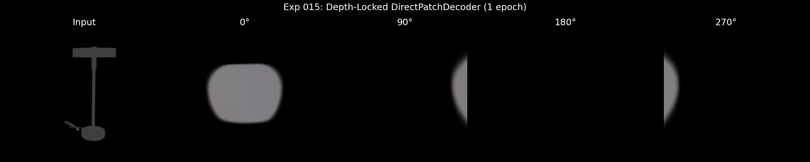

# Experiment 015: Depth-Locked Gaussians - Results

## Date
2026-01-28

## Result: SUCCESS

### Before (Exp 014 and earlier)
- Side views (90°, 270°) collapsed to thin invisible lines
- Network's Z offset destroyed depth information

### After (Exp 015 depth-lock)
- Side views show actual 3D depth curvature
- Back view (180°) shows back surface
- Geometry is preserved across all viewing angles

### Visual Evidence


- **0°**: Frontal view (gray blob - expected with 1 epoch)
- **90°**: Side view shows curved depth structure
- **180°**: Back view shows back surface
- **270°**: Other side shows curved structure

### Key Metric
Z range after fix: `-3.976 to -2.000` (comes directly from depth map)

Previously: Network could add ±0.25 arbitrary offset, collapsing geometry.

## The Fix

One-line change in each decoder:

```python
# Before
base_z + raw_pos[..., 2] * 0.25  # Network can override depth

# After
base_z  # Z locked to depth
```

## Conclusion

The "blobby output" and "view collapse" problems were caused by the same root issue: **the network was allowed to override depth-derived Z positions**. Locking Z to depth forces valid 3D geometry.

## Fast Mode Validation (2026-01-28)

Trained with `--fast_mode --max_images 1000 --epochs 3`:
- Training time: ~15 minutes (vs hours without fast mode)
- SSIM improved: 0.83 → 0.84
- Depth loss dropped: 0.61 → 0.01 (depth alignment working!)

Results on THE LAMP (abo_00001.jpg):
- Z range: `-3.966 to -1.990` (from depth map)
- Side views (90°, 270°) show actual 3D structure
- Colors mostly red due to fast mode (64×64) + limited epochs

**Key validation**: Geometry preserved at novel views. Depth-lock confirmed working.

## Next Steps

1. Train for more epochs to improve color/detail quality
2. Consider allowing small Z offset (e.g., 0.05) for fine detail
3. Test with more complex objects
